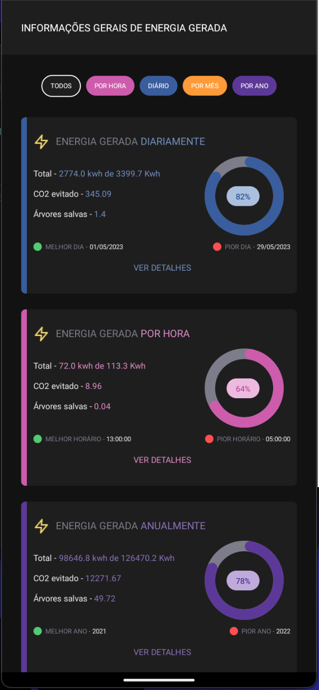

# Yellot App

<p>Um simples app que mostra o quanto minha usina está gerando de energia em períodos diferentes.</p>

## Tópicos

[Tecnologias e Ferramentas](#tecnologias-e-ferramentas)

[Instalação e uso](#instalação-e-uso)

<br>

## Tecnologias e Ferramentas

As seguintes tecnologias foram utilizadas no desenvolvimento do projeto:

- [React Native](https://reactnative.dev/)
- [Typescript](https://www.typescriptlang.org/)
- [Jest](https://jestjs.io/pt-BR/)
- [React Native Testing Library](https://testing-library.com/docs/react-native-testing-library/intro/)

<br>

## Instalação e Uso

Para rodar em algum emulador em seu computador, você precisa instalar e configurar todas a ferramentas necessárias. Você pode encontrar o passo a passo aqui [configurando ambiente para aplicações React Native](https://reactnative.dev/docs/environment-setup)

Siga os passos abaixo:

```bash
# Abra um terminal e copie este repositório com o comando
$ git clone https://github.com/vitorSantanaDev/solar-power-plant-generation-app.git

# Entre na pasta com
$ cd solar-power-plant-generation-app

# Instale as dependências
$ yarn install

# Rode a aplicação no android
$ yarn android

# Rode a aplicação no ios
$ yarn ios

# Rode os testes
$ yarn test

# Gere um apk para instalação no android
$ yarn build:android

$ Encontre o apk gerado em /android/app/build/outputs/apk/release

$ O nome do arquivo vai está assim -> 'app-release.apk'
```

<br>

Para usar o app é simples, logo de na Home, você verá cards com informações gerais sobre a energia gerada pela usina.



Logo Após o título da tela exite uma lista de filtros que podem ser usados para filtrar exatamente o período que você que ver as informações.


Clicando no botão de "VER DETALHES" do card selecionado, você irá para uma outra tela, onde obterá informações mais detalhadas sobre a energia gerada naquele período selecionado.


OBS: Existem vários pontos de melhorias no código e visualmente, mas devido ao prazo apertado, não foi possível trabalhar nesses pontos.

Feito com :technologist: by [Vitor_Santana](https://github.com/vitorSantanaDev)

[](https://www.linkedin.com/in/vitor-santana-bbb607217/)
[](mailto:vitorsantana.developer@gmail)
